# Projeto ETL Bees
#### Projeto para avaliação de construção de um Pipeline de dados.

O projeto ETL Bees tem como objetivo:
- Consumir dados da API Open Brewery DB
- Transformá-los
- Armazená-los em um Data Lake seguindo a arquitetura medallion

## Estrutura de Orquestração, Processamento e Visualização de Dados

Docker compose para orquestração dos contêineres abaixo:
- **Airflow** 
  - Scheduler
  - Worker
  - Web Interface
  - PostgreSQL
  - Redis
- **Spark**
  - Master
  - Node
- **Editor de Notebook**
  - Jupyter


## Arquitetura do Pipeline ETL

O pipeline ETL implementado segue a arquitetura **medallion**, que se divide em três camadas principais:

1. **Bronze Layer**: Persistência dos dados brutos coletados da API, mantendo o formato original para garantir a integridade.  
   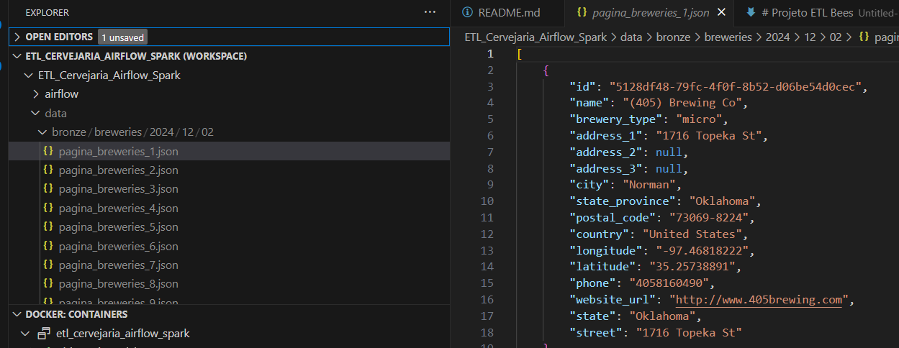 

2. **Silver Layer**: Transformação dos dados brutos em um formato colunar, como Parquet, e particionamento por localização. Essa camada garante uma estrutura mais otimizada para consultas.  
   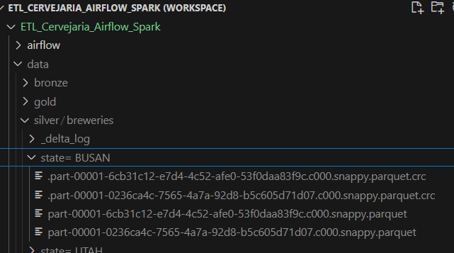 

3. **Gold Layer**: Criação de uma visão agregada dos dados, mostrando a quantidade de cervejarias por tipo e localização, proporcionando uma análise mais detalhada e rápida dos dados.  
   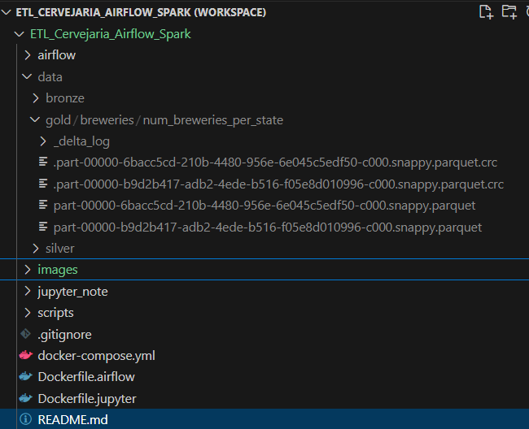 

## Passos para Configurar e Executar o Projeto

### 1. Clonar o Repositório

Comece clonando o repositório do GitHub para sua máquina local. Abra o terminal e execute o seguinte comando:

```bash
$ git clone https://github.com/Varbuck/etl_bees.git
```

Depois de clonado, entre no diretório do projeto:

```bash
$ cd etl_bees
```

### 2. Estrutura do Projeto

A estrutura do projeto é organizada conforme o padrão recomendado para projetos de dados. Aqui está uma visualização do que você encontrará após clonar o repositório:  
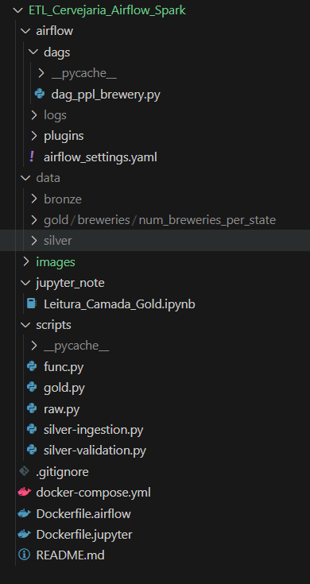 


### 3. Configurar o Docker

Caso prefira rodar o projeto em um ambiente conteinerizado, utilize o Docker. Para construir a imagem, execute o comando abaixo dentro do diretório do projeto:

```bash
$ docker compose build
```

Dê permissões de acesso aos arquivos:

```bash
$ sudo chmod -R 777 *
```

Para iniciar os contêineres:

```bash
$ docker compose up -d
```

Três portas estarão disponíveis no localhost:
- [localhost:8080](http://localhost:8080) - Apache Spark  
  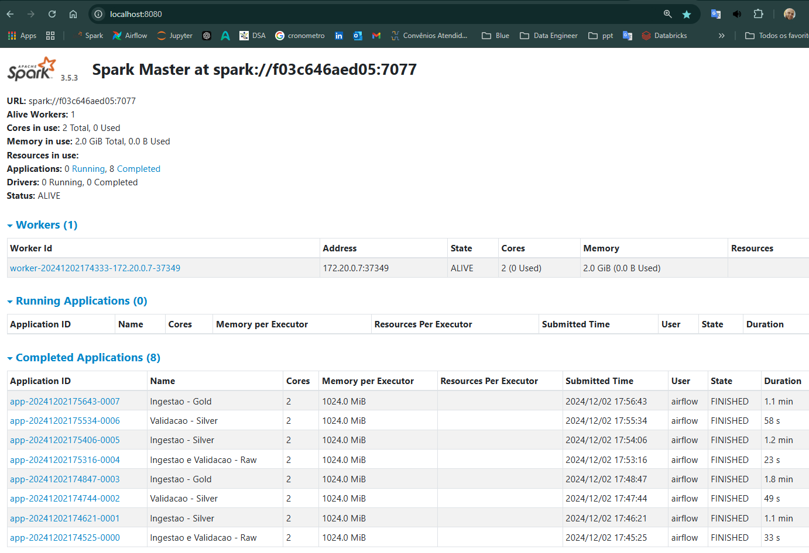 
- [localhost:8081](http://localhost:8081) - Apache Airflow (login: admin, senha: admin)  
  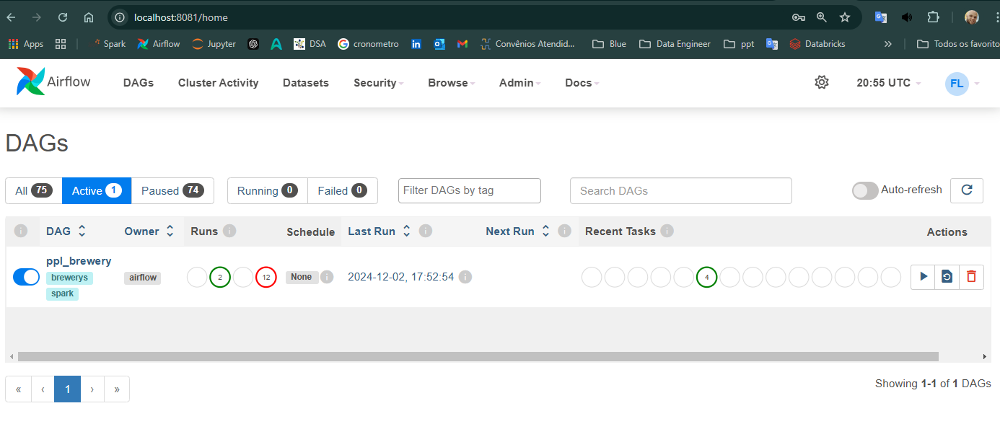 
- [localhost:8888](http://localhost:8888) - Jupyter Notebook  
  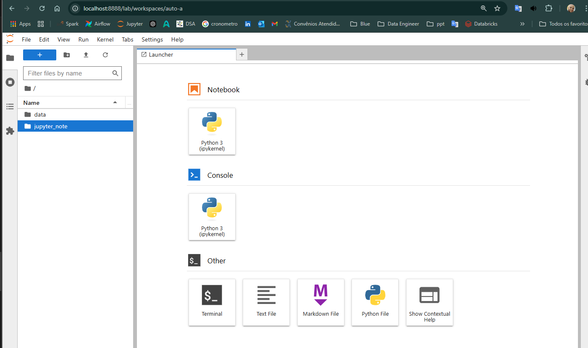 

### 4. Configurar a Ferramenta de Orquestração

- Abra o navegador e acesse [http://localhost:8081](http://localhost:8081) para acessar a interface do Airflow.
- Configure a conexão:
  - Clique em "ADM" 
  - Clique em "Connections"
  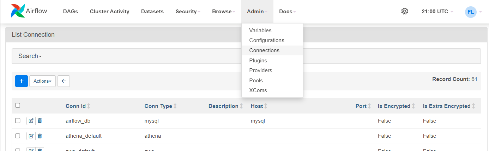   

  - Preencha os campos com os valores:
  - 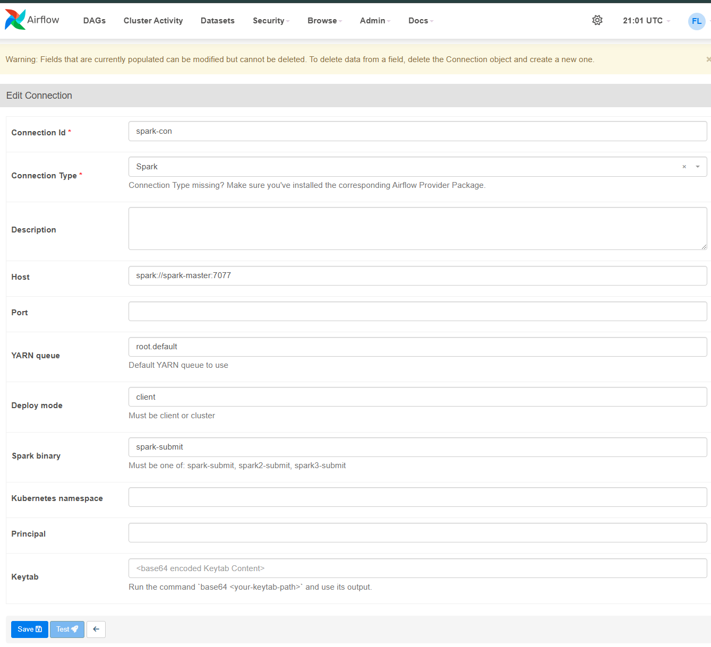  
    - Connection Id: spark-con
    - Connection Type: Spark
    - Host: spark://spark-master
    - Port: 7077
    - Clique em Salvar


### 5. Executar o Pipeline ETL


- No Airflow, clique em "DAGS" e selecione o DAG "brewery_list" para executar.  
  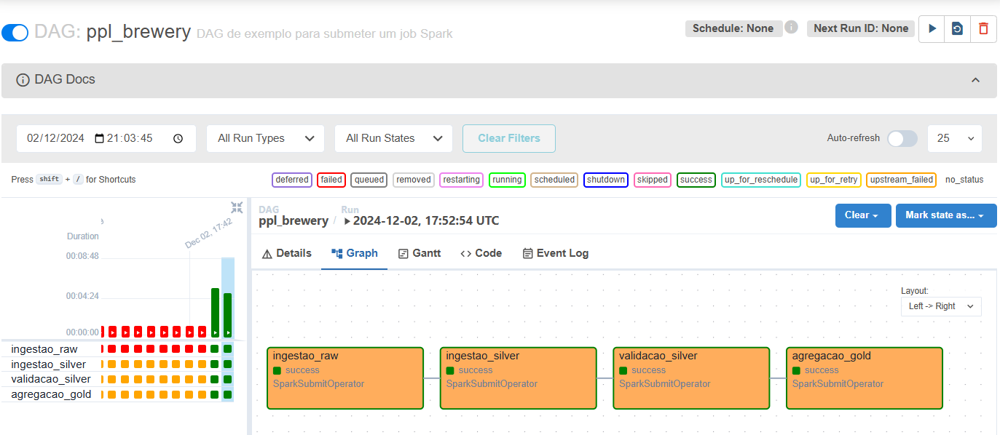 


- O pipeline é composto por quatro etapas passando por três camadas:
  - **Bronze**: Persistência dos dados brutos da API.
  - **Silver**: Transformação para armazenamento em formato colunar (como Parquet) e particionado por localização.
  - **Gold**: Criação de uma visão agregada com a quantidade de cervejarias por tipo e localização.


### Visualizar os dados no Jupyter 

  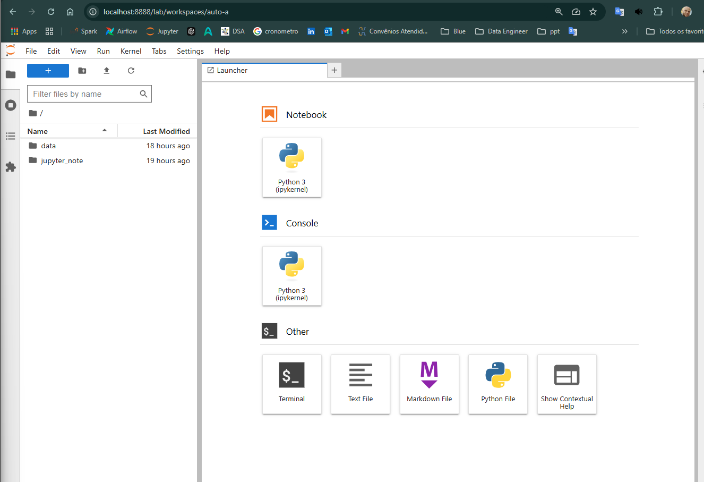 

- Abra a pasta jupyter_note
- Abra notebook Leitura_camada_gold  
- Execute as células

  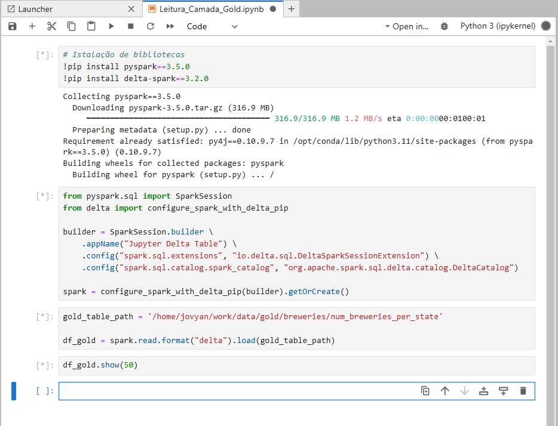 

- Resultado
  
  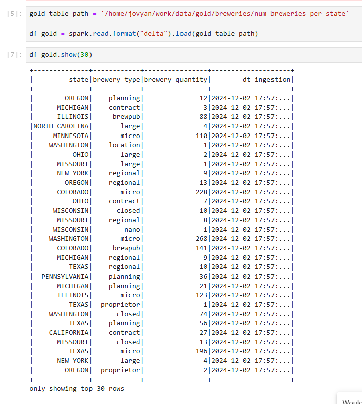 

